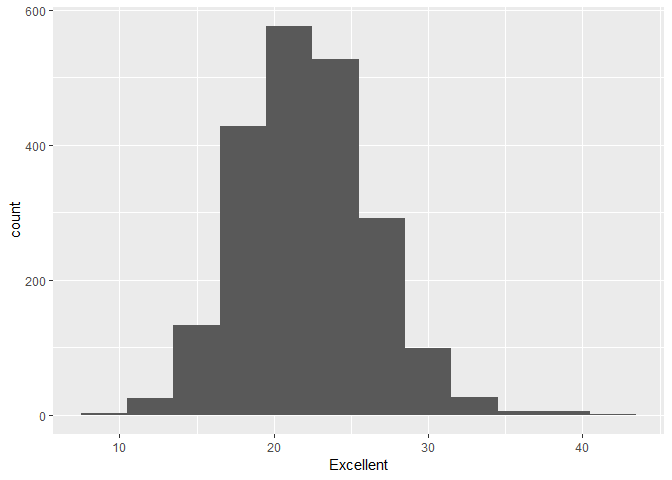

p8105\_hw2\_yl3181
================
Yuelin Long
September 28, 2018

Problem 1
---------

Read and Clean the data. Generate a summary of the data.

``` r
library(tidyverse)
```

    ## -- Attaching packages ------------------------------------------------------- tidyverse 1.2.1 --

    ## v ggplot2 3.0.0     v purrr   0.2.5
    ## v tibble  1.4.2     v dplyr   0.7.6
    ## v tidyr   0.8.1     v stringr 1.3.1
    ## v readr   1.1.1     v forcats 0.3.0

    ## -- Conflicts ---------------------------------------------------------- tidyverse_conflicts() --
    ## x dplyr::filter() masks stats::filter()
    ## x dplyr::lag()    masks stats::lag()

``` r
# Load data, clean names, select variables that are needed, and change variables type
nyc_subway = read_csv("NYC_Transit_Subway_Entrance_And_Exit_Data.csv") %>%
             janitor::clean_names() %>%
             select(line:entry,vending, ada) %>% 
             mutate(entry = recode(entry, "YES" = as.logical(1), "NO" = as.logical(0)))
```

    ## Parsed with column specification:
    ## cols(
    ##   .default = col_character(),
    ##   `Station Latitude` = col_double(),
    ##   `Station Longitude` = col_double(),
    ##   Route8 = col_integer(),
    ##   Route9 = col_integer(),
    ##   Route10 = col_integer(),
    ##   Route11 = col_integer(),
    ##   ADA = col_logical(),
    ##   `Free Crossover` = col_logical(),
    ##   `Entrance Latitude` = col_double(),
    ##   `Entrance Longitude` = col_double()
    ## )

    ## See spec(...) for full column specifications.

Summary:

-   Data name: nyc\_subway
-   Variables included: line, station\_name, station\_latitude, station\_longitude, route1, route2, route3, route4, route5, route6, route7, route8, route9, route10, route11, entrance\_type, entry, vending, ada
-   Data cleaning steps: clean names -&gt; select variables needed -&gt; change character variables to logical
-   Data dimension (rows x columns): 1868, 19
-   Data quality: not tidy because the route1 - route11 should be values instead of column names

``` r
# Further clean the data by change route from wide format to long format, clean the route variables, remove missing values and duplicates
nyc_subway_clean =  gather(nyc_subway, key = route_num, value = route_val, starts_with("route")) %>%
             separate(route_num, into = c("extra_route","route"), sep = 5) %>%
             select(-extra_route) %>%
             filter(!is.na(route_val)) %>%
             distinct(nyc_subway, line, station_name, .keep_all = TRUE)
```

    ## Warning: Trying to compute distinct() for variables not found in the data:
    ## - `nyc_subway`
    ## This is an error, but only a warning is raised for compatibility reasons.
    ## The following variables will be used:
    ## - line
    ## - station_name

Answer to the questions:

-   Number of distinct stations: 465
-   Number of stations with ADA compliance: 84
-   Proportion of station entrance without vending: 0.3770492
-   Number of distinct stations serving A train: 60
-   Number of distinct stations serving A train with ADA compliance: 17

Problem 2
---------

Load the datasets:

``` r
# Load Mr.trash data, clean names, remove missing values and change variable type to integer
mr_trash = readxl::read_excel("HealthyHarborWaterWheelTotals2017-9-26.xlsx", sheet = "Mr. Trash Wheel", range = "A2:N258") %>%
    janitor::clean_names() %>%
    filter(!is.na(dumpster)) %>%
    mutate(sports_balls = as.integer(sports_balls))

# Load 2016 data, clean names, add variable year, and remove missing values 
trash_2016 = readxl::read_excel("HealthyHarborWaterWheelTotals2017-9-26.xlsx", sheet = "2016 Precipitation", range = "A2:B14") %>%
    janitor::clean_names() %>%
    mutate(year = 2016) %>%
    filter(!is.na(total))

# Load 2017 data, clean names, add variable year, and remove missing values 
trash_2017 = readxl::read_excel("HealthyHarborWaterWheelTotals2017-9-26.xlsx", sheet = "2017 Precipitation", range = "A2:B14") %>%
    janitor::clean_names() %>%
    mutate(year = 2017) %>%
    filter(!is.na(total))

library(plyr)
```

    ## -------------------------------------------------------------------------

    ## You have loaded plyr after dplyr - this is likely to cause problems.
    ## If you need functions from both plyr and dplyr, please load plyr first, then dplyr:
    ## library(plyr); library(dplyr)

    ## -------------------------------------------------------------------------

    ## 
    ## Attaching package: 'plyr'

    ## The following objects are masked from 'package:dplyr':
    ## 
    ##     arrange, count, desc, failwith, id, mutate, rename, summarise,
    ##     summarize

    ## The following object is masked from 'package:purrr':
    ## 
    ##     compact

``` r
# Combine 2016 and 2017, clean names, and change month variable type to character
trash_2016_2017 = bind_rows(trash_2016, trash_2017)  %>%
    janitor::clean_names() %>%
    dplyr::rename(precipitation = total) %>%
    mutate(month = mapvalues(month,from = c(1:12), to = month.name))

summary(trash_2016_2017)
```

    ##     month           precipitation        year     
    ##  Length:20          Min.   :0.620   Min.   :2016  
    ##  Class :character   1st Qu.:2.125   1st Qu.:2016  
    ##  Mode  :character   Median :3.400   Median :2016  
    ##                     Mean   :3.494   Mean   :2016  
    ##                     3rd Qu.:4.695   3rd Qu.:2017  
    ##                     Max.   :7.090   Max.   :2017

Data summary:

-   The total N for Mr. Trash is 215, and the number of variables is 14. The examples of key variables are dumpster, month, year, date, weight\_tons, volume\_cubic\_yards, plastic\_bottles
-   The total N for trash in 2016 and 2017 is 20, and the number of variables is 3. The key variables are month, precipitation, year
-   The total precipitation in 2017 is 29.93
-   The median number of sports balls in a dumpster in 2016 is 26

Problem 3
---------

``` r
library(p8105.datasets)
# Load data, clean names, select needed variables, expand response variables, and create a new variables to combine Excellent and very good.
brfss = janitor::clean_names(brfss_smart2010) %>%
    filter(topic == "Overall Health") %>%
    select(year:locationdesc, response, data_value) %>%
    spread(key = response, value = data_value) %>%
    mutate(excellent_verygood = Excellent + `Very good`) 
```

Data Summary:

-   Number of unique locations is 404
-   Is every state represented: TRUE
-   State that is observed the most: NJ
-   In 2002, the median of the “Excellent” response value is 23.6

Data Visualization:

A histogram of “Excellent” response values in the year 2002

``` r
# Plot a histogram with Excellent response in 2002. For histogram, the bins are recommended to be 5~12, so choose binwidth = 3 to have less bins.
ggplot(brfss,aes(x = Excellent)) + geom_histogram(binwidth = 3)
```

    ## Warning: Removed 6 rows containing non-finite values (stat_bin).



A scatterplot showing the proportion of “Excellent” response values in New York County and Queens County (both in NY State) in each year from 2002 to 2010.

``` r
# Plot a scatterplot, add add smooth trend lines to show the changes of Excellent response with time in New York and Queens 
ggplot(brfss[brfss$locationdesc %in% c("NY - New York County", "NY - Queens County"),],aes(x = year, y = Excellent, color = locationdesc)) + 
    geom_point() +
    geom_smooth(se = FALSE) 
```

    ## `geom_smooth()` using method = 'loess' and formula 'y ~ x'


